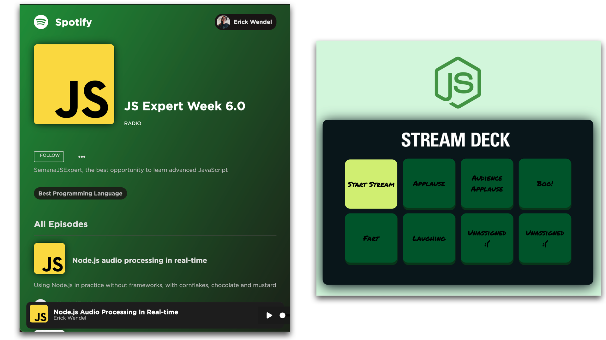

# Spotify Radio - Semana JS Expert 6.0

## Preview

## Checklist Features

## Tarefas por aula

- Aula 01: Cobrir as camadas service e route com testes unitários e alcançar 100% de code coverage
- Aula 02: Manter 100% de code coverage e implementar testes e2e para toda a API
- Aula 03: implementar testes unitários para o frontend e manter 100% de code coverage
- **PLUS**: 
    - [ ] disponibilizar um novo efeito
        - [ ] adicionar um botão novo no controlador
        - [ ] adicionar um som de efeito novo para a pasta `audios/fx/`
        - [ ] republicar no heroku

